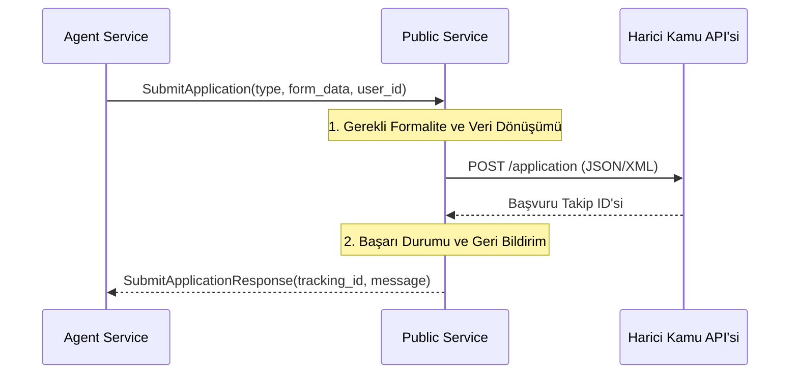

# 🏛️ Sentiric Vertical Public Service - Mantık ve Akış Mimarisi

**Stratejik Rol:** Kamu hizmetleri, vergi veya kimlik doğrulama gibi devlet kurumlarına özgü süreçleri basitleştirir.

---

## 1. Temel Akış: Başvuru Gönderme (SubmitApplication)

## 2. Hassasiyet ve Adaptasyon
Kamu hizmetleri, genellikle XML veya SOAP gibi eski protokoller kullanır ve yüksek güvenlik (e-devlet entegrasyonları) gerektirir. Bu servis, bu karmaşık protokolleri modern gRPC arayüzüne çeviren adaptör katmanı olarak işlev görür.